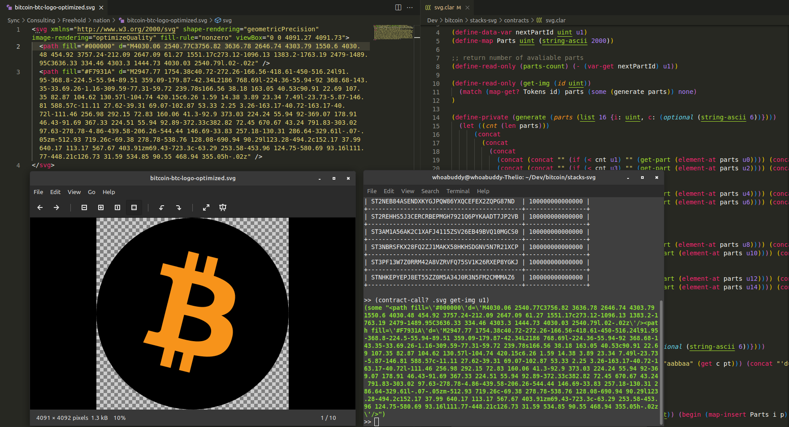

# Storing SVGs on Stacks

**Archiving this as read-only** - issues and work being moved to the [`bitcoin-colors` repo](https://github.com/bitcoin-nfts/bitcoin-colors).

Can we store and return SVG data from Clarity contracts?

